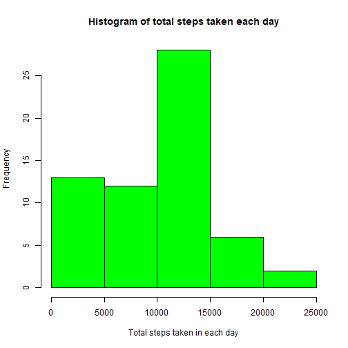
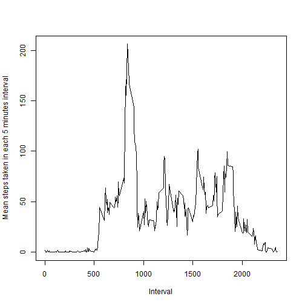
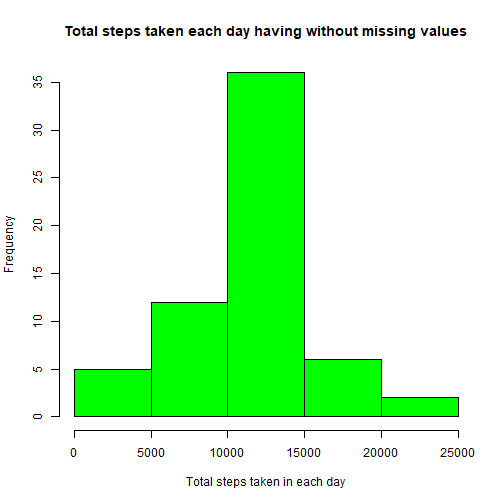
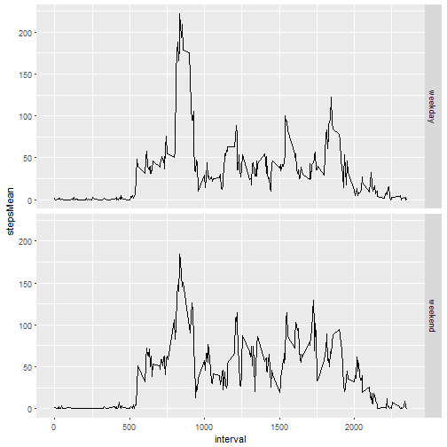

## Loading and preprocessing the data

We simply read the data and indicates the read.csv function the class of each column, in this case numeric, Date and numeric:


```r
data<-read.csv("activity.csv",sep=",",colClasses = c("numeric","Date","numeric"))
```

## The total, mean and median of steps taken each day

We are going to calculate the total, mean and median for the steps taken each day:


```r
uniDates<-unique(data$date)
sumSteps<-1:length(uniDates)

for (i in 1:length(uniDates)){
  sumSteps[i]<-sum(data[data$date==uniDates[i],1],na.rm = TRUE)
}
hist(sumSteps,col="green",xlab = "Total steps taken in each day",main="Histogram of total steps taken each day")
```



```r
mean(sumSteps)
```

```
## [1] 9354.23
```

```r
median(sumSteps)
```

```
## [1] 10395
```

## Daily activity pattern

We are going to calculate the mean steps taken in each interval of everyday.


```r
uniInterv<-unique(data$interval)
meanSteps<-1:length(uniInterv)
for (i in 1:length(uniInterv)){
  meanSteps[i]<-mean(data[data$interval==uniInterv[i],1],na.rm = TRUE)
}
plot(uniInterv,meanSteps,col="black",type="l",xlab="Interval",ylab="Mean steps taken in each 5 minutes interval")
```



```r
uniInterv[which.max(meanSteps)]
```

```
## [1] 835
```
As you can see, it seems that the interval that has the most activity is the interval 835.

## Imputing missing values
The total number of missing values is: 

```r
sum(is.na(data$steps))
```

```
## [1] 2304
```

We are first going to create a new dataset that contains the same information as before but with the NA's filled with the mean value for its interval:

```r
dataNA<-data
for (i in 1:length(uniInterv)){
 dataNA[dataNA$interval==uniInterv[i] & is.na(dataNA$steps),1] <- mean(dataNA[dataNA$interval==uniInterv[i],1],na.rm = TRUE)
}
```
And as we did previously, we proceed to use a for loop to calculate the sum of the steps taken each day as well as its mean and median and then we are going to plot the histogram of the toal steps taken each day  of the new dataset

```r
uniDates<-unique(data$date)
sumStepsNA <- 1:length(uniDates)
for (i in 1:length(uniDates)){
  sumStepsNA[i]<-sum(dataNA[dataNA$date==uniDates[i],1])
  
}
hist(sumStepsNA,col="green",xlab = "Total steps taken in each day",main="Total steps taken each day having without missing values")
```



```r
mean(sumStepsNA)
```

```
## [1] 10766.19
```

```r
median(sumStepsNA)
```

```
## [1] 10766.19
```
As we can observe from the results, the mean and median having substituted the missing values have increased.


## Activity pattern differentiating between weekdays and weekends

We are first going to add a variable call dayType that indicate if that date is a weekday or a weekend day:


```r
uniDates<-unique(data$date)
dataNA[,4]<-"weekend"
dataNA[grep("lu|ma|miér|ju|vi",weekdays(dataNA[,2])),4]<-"weekday"
dataNA[,4]<-as.factor(dataNA[,4])
names(dataNA)[4]<-"dayType"
```

Then we are going to calculate the mean of each interval for each type of day and plot both patterns:


```r
actDay<-ddply(subset(dataNA,dayType=="weekday"),"interval",summarise,mean=mean(steps))[,2]
actEnd<-ddply(subset(dataNA,dayType=="weekend"),"interval",summarise,mean=mean(steps))[,2]
res1 <- data.frame(stepsMean=actDay,dayType="weekday",interval=unique(dataNA$interval))
res2 <- data.frame(stepsMean=actEnd,dayType="weekend",interval=unique(dataNA$interval))
res<-rbind(res1,res2)
g <- ggplot(data=res,aes(x=interval,y=stepsMean)) + geom_line() + facet_grid(dayType ~ .)
plot(g)
```



```r
#res
```
